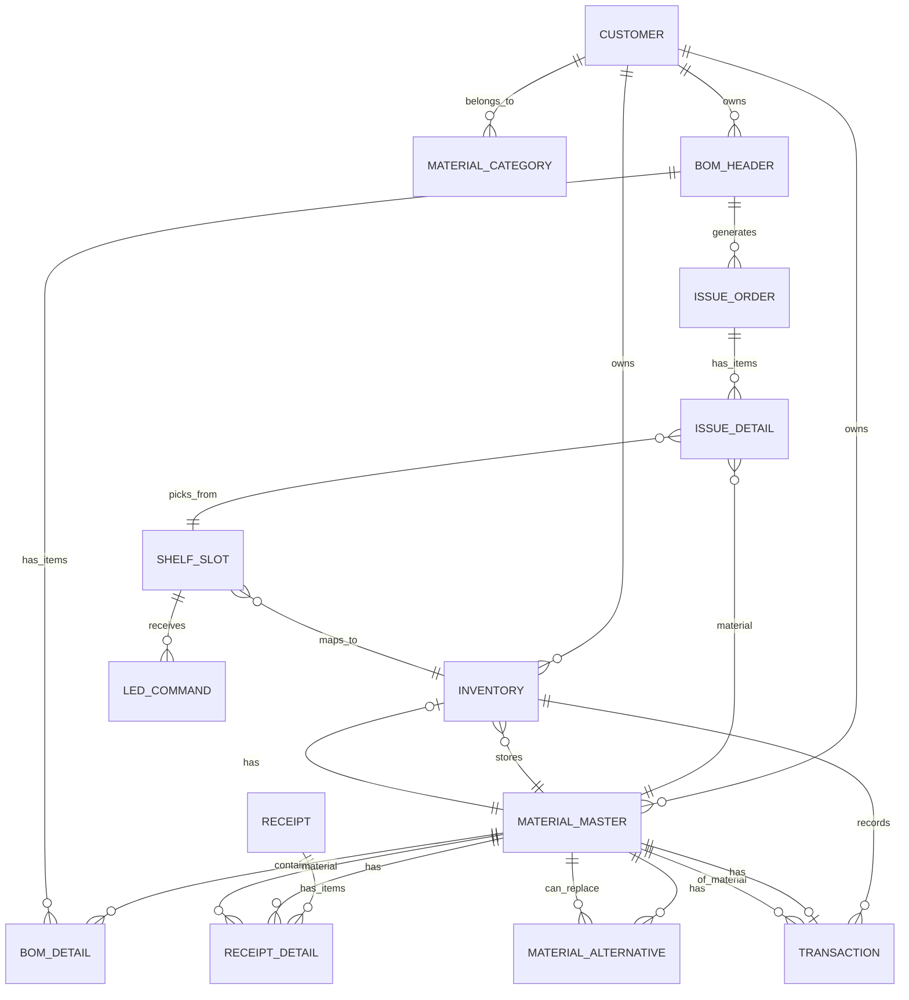

# 七鑫智能物料架系统 · 系统设计说明书

> 基于《需求分析》+《通信协议规范》+《硬件板资料汇总》+《待确认清单》
> 读者对象：Design / Dev / QA / PM

---

## 1. 系统总览

### 1.1 目标

实现**原材料入库 → BOM 发料 → 智能亮灯/FIFO 出库 → 退库点计 → 日清账务**的全流程数字化防呆管理。

### 1.2 终端与硬件拓扑

```
┌─────────────┐    扫码/操作     ┌───────────────────┐
│ Android PDA │ ◄─────────────► │  Android App (Kiosk)│
│  (仓库操作员) │    WiFi/局域网   │  全屏/大按钮/抗疲劳  │
└──────┬──────┘                  └─────────┬─────────┘
       │ HTTP/REST API (HTTPS)              │
       ▼                                    │
┌──────────────┐                              │
│  Backend API │◄─────────────────────────────┘
│  (FastAPI)   │   本地局域网部署 (可选 Docker)
└──────┬───────┘
       │ Modbus TCP (端口 502)
       ▼
┌───────────────────┐     RS485 (38400bps)    ┌─────────────────┐
│ AMKN8702G 主控板   │ ◄────────────────────► │ AMKN7141 灯板 ×N │
│ 站号: 200          │  COM1→A面(1-63)        │ A面: 站号 1-N    │
│ IP: DHCP/配置      │  COM2→B面(64-126)      │ B面: 站号 1-N    │
│ 继电器 K1-K6       │                         │ 20/10/6 储位/板   │
└───────────────────┘                         └─────────────────┘

XR 点料机
  └── 蓝牙/串口/WiFi ──► Android PDA ──► API 上传
```

### 1.3 技术栈决策

| 层级 | 技术 | 选型理由 |
|------|------|----------|
| **前端 (PC Web)** | React 18 + Vite + Ant Design 5 | 客户/物料/替代料维护、BOM 管理、发料单管理、报表、系统配置 |
| **前端 (PDA)** | React Native (Expo) SDK 50 + React Navigation | 扫码入库/出库/退库、离线模式、全屏 Kiosk |
| **共享层** | TypeScript + TanStack Query + Zustand + API 请求封装 | 认证、FIFO 算法、防呆校验、条码解析、类型定义 |
| **后端** | Python 3.11 + FastAPI | 轻量、异步 IO、Modbus 库生态好、AI 扩展友好 |
| **数据库** | SQLite (本地) / PostgreSQL (云端可选) | 单机部署首选 SQLite；多厂多租户时 PG |
| **硬件通信** | minimalmodbus (RTU) + pymodbus (TCP) | 工业级 Modbus 标准库 |
| **缓存** | Redis (可选, 亮灯队列) | FIFO 计算队列、实时亮灯指令分发 |
| **部署** | Docker Compose (推荐) 或 pip 直装 | 工厂内网离线部署 |
| **离线模式** | PDA 本地 SQLite + 断网重试 | 网络中断不中断操作 |
| **OCR 识别** | PaddleOCR (百度开源) | 物料标签文字识别、自动旋转纠偏 |
| **条码解析** | ZXing (Apache 2.0) | 1D/2D 条码解码，替代 Google ML Kit |

### 1.4 数据流向

```
1. 入库: PDA 扫码 → API 创建入库单 → 写 DB → 可选: 亮灯引导上架
2. BOM: 上传 BOM Excel → API 解析 → 建立发料需求 → 计算亮灯方案
3. 出库: API 按 FIFO 算法计算 → 生成亮灯指令 → Modbus TCP → 料架亮灯
4. 退库: PDA 扫码 + XR 点数 → API 校验 → 二次入库 → 库存更新
5. 日报: API 按日汇总 → 生成 in_stock / online / balance 报表
```

---

## 2. 数据库 Schema (SQLite)

### 2.1 ER 关系图 (Mermaid)



### 2.2 表定义

#### 2.2.1 `customers` — 客户

```sql
CREATE TABLE customers (
    id              INTEGER PRIMARY KEY AUTOINCREMENT,
    name            TEXT NOT NULL,            -- 客户名称
    code            TEXT UNIQUE NOT NULL,     -- 客户编码
    contact_name    TEXT,                     -- 联系人
    contact_phone   TEXT,                     -- 联系方式
    active          INTEGER DEFAULT 1,        -- 是否启用
    created_at      TEXT DEFAULT (datetime('now')),
    updated_at      TEXT DEFAULT (datetime('now'))
);
```

#### 2.2.2 `material_categories` — 物料分类 (客户维)

```sql
CREATE TABLE material_categories (
    id              INTEGER PRIMARY KEY AUTOINCREMENT,
    customer_id     INTEGER REFERENCES customers(id),
    name            TEXT NOT NULL,            -- 分类名称
    code            TEXT NOT NULL,            -- 分类编码
    parent_id       INTEGER REFERENCES material_categories(id), -- 层级
    FOREIGN KEY (parent_id) REFERENCES material_categories(id)
);
CREATE UNIQUE INDEX idx_cat_customer_code ON material_categories(customer_id, code);
```

#### 2.2.3 `material_master` — 物料主数据

```sql
CREATE TABLE material_master (
    id              INTEGER PRIMARY KEY AUTOINCREMENT,
    customer_id     INTEGER NOT NULL REFERENCES customers(id),
    category_id     INTEGER REFERENCES material_categories(id),
    code            TEXT NOT NULL,            -- 物料编码 (客户提供的编码)
    name            TEXT NOT NULL,            -- 物料名称
    spec            TEXT,                     -- 规格型号
    unit            TEXT DEFAULT '盘',        -- 计量单位
    qty_per_pallet  REAL,                     -- 标准每盘数量 (用于 FIFO 换算)
    barcode_pattern TEXT,                     -- 扫码正则 (如 "^[A-Z]{2}[0-9]{8}$")
    active          INTEGER DEFAULT 1,
    created_at      TEXT DEFAULT (datetime('now')),
    updated_at      TEXT DEFAULT (datetime('now')),
    FOREIGN KEY (customer_id) REFERENCES customers(id)
);
CREATE UNIQUE INDEX idx_mat_customer_code ON material_master(customer_id, code);
```

#### 2.2.4 `material_alternative` — 替代料关系

```sql
CREATE TABLE material_alternative (
    id              INTEGER PRIMARY KEY AUTOINCREMENT,
    original_code   TEXT NOT NULL,            -- 原物料编码
    alternate_code  TEXT NOT NULL,            -- 替代料编码 (1:1 一对一)
    customer_id     INTEGER NOT NULL REFERENCES customers(id),
    active          INTEGER DEFAULT 1,
    FOREIGN KEY (customer_id) REFERENCES customers(id)
);
CREATE INDEX idx_alt_original ON material_alternative(customer_id, original_code);
CREATE INDEX idx_alt_alternate ON material_alternative(customer_id, alternate_code);
```

> **替代料关系**: 1:1 一对一，无换算比例，无优先级。

#### 2.2.5 `shelves` — 智能料架 (物理设备)

```sql
CREATE TABLE shelves (
    id              INTEGER PRIMARY KEY AUTOINCREMENT,
    code            TEXT UNIQUE NOT NULL,     -- 料架编码 (如 SH-A-01)
    name            TEXT,                     -- 料架名称
    a_sides         INTEGER DEFAULT 0,        -- A面储位数
    b_sides         INTEGER DEFAULT 0,        -- B面储位数
    total_slots     INTEGER DEFAULT 0,        -- = a_sides*20 + b_sides*20
    controller_ip   TEXT,                     -- AMKN8702G IP 地址
    controller_port INTEGER DEFAULT 502,
    a_side_count    INTEGER DEFAULT 0,        -- A面灯板数
    b_side_count    INTEGER DEFAULT 0,        -- B面灯板数
    location        TEXT,                     -- 物理位置 (如 "A区-1号架")
    active          INTEGER DEFAULT 1,
    created_at      TEXT DEFAULT (datetime('now'))
);
```

#### 2.2.6 `shelf_slots` — 储位 (逻辑映射)

```sql
CREATE TABLE shelf_slots (
    id              INTEGER PRIMARY KEY AUTOINCREMENT,
    shelf_id        INTEGER NOT NULL REFERENCES shelves(id),
    side            TEXT NOT NULL CHECK(side IN ('A', 'B')), -- A面/B面
    board_address   INTEGER NOT NULL,         -- 灯板 Modbus 地址 (1-N)
    slot_on_board   INTEGER NOT NULL,        -- 板内储位号 (1-20)
    global_index    INTEGER NOT NULL,         -- 全局储位序号 (1~total_slots)
    modbus_tcp_id   INTEGER NOT NULL,         -- TCP 站号 (1-63 A面, 64-126 B面)
    modbus_coil_base INTEGER NOT NULL,       -- 线圈基址 (协议1/2)
    FOREIGN KEY (shelf_id) REFERENCES shelves(id)
);
CREATE UNIQUE INDEX idx_slot_pos ON shelf_slots(shelf_id, side, slot_on_board);
```

> **储位全局索引**：按 `shelf_id, side, global_index` 升序排列。全局索引 = 该料架内从 1 开始到 total_slots 的连续编号。

#### 2.2.7 `inventory_pallets` — 物料盘库存 (核心实体)

```sql
CREATE TABLE inventory_pallets (
    id                  INTEGER PRIMARY KEY AUTOINCREMENT,
    material_id         INTEGER NOT NULL REFERENCES material_master(id),
    shelf_slot_id       INTEGER REFERENCES shelf_slots(id), -- NULL=未上架
    quantity            REAL NOT NULL,            -- 当前盘内数量
    original_quantity   REAL NOT NULL,            -- 原始入库数量
    pallet_barcode      TEXT,                     -- 盘体条码 (如果有)
    customer_code       TEXT,                     -- 客户编码 (来料条码)
    
    -- 时间戳链 (用于 FIFO 排序和退库配对)
    first_in_time       TEXT NOT NULL,            -- 首次入库时间
    last_in_time        TEXT NOT NULL,            -- 最近一次上架时间
    last_out_time       TEXT,                     -- 最后出库时间
    last_out_order_id   INTEGER,                  -- 关联出库单
    
    -- 生命周期
    inbound_type        TEXT DEFAULT 'new',       -- 'new'=首次入库, 'restock'=二次入库
    inbound_receipt_id  INTEGER REFERENCES receipt_pallets(id), -- 来源入库单
    inbound_xr_count    REAL,                     -- XR 点数回填数量
    status              TEXT DEFAULT 'on_shelf',  -- on_shelf/in_use/tracking/exhausted
    customer_id         INTEGER NOT NULL,
    created_at          TEXT DEFAULT (datetime('now')),
    updated_at          TEXT DEFAULT (datetime('now'))
);
CREATE INDEX idx_inv_material ON inventory_pallets(customer_id, material_id, status);
CREATE INDEX idx_inv_fifo ON inventory_pallets(customer_id, material_id, last_in_time, quantity) WHERE status = 'on_shelf';
CREATE INDEX idx_inv_tracking ON inventory_pallets(customer_id, status, last_out_time) WHERE status = 'tracking';
```

#### 2.2.8 `receipt_pallets` — 入库盘记录

```sql
CREATE TABLE receipt_pallets (
    id              INTEGER PRIMARY KEY AUTOINCREMENT,
    receipt_id      INTEGER NOT NULL,             -- 关联入库单
    material_id     INTEGER NOT NULL REFERENCES material_master(id),
    quantity        REAL NOT NULL,                -- 入库数量
    barcode         TEXT,                         -- 扫描条码
    scanned_at      TEXT DEFAULT (datetime('now')),
    operator        TEXT,                         -- 操作员
    shelf_slot_id   INTEGER REFERENCES shelf_slots(id), -- 分配储位
    inventory_pallet_id INTEGER,                  -- 关联 inventory_pallets
    is_restock      INTEGER DEFAULT 0,            -- 是否二次入库 (退库再上架)
    restock_match_key TEXT,                       -- XR 配对标识
    FOREIGN KEY (material_id) REFERENCES material_master(id)
);
```

#### 2.2.9 `receipt` — 入库单

```sql
CREATE TABLE receipt (
    id              INTEGER PRIMARY KEY AUTOINCREMENT,
    receipt_no      TEXT UNIQUE NOT NULL,         -- 入库单号 (RC-YYYYMMDD-NNN)
    customer_id     INTEGER NOT NULL REFERENCES customers(id),
    created_at      TEXT DEFAULT (datetime('now')),
    created_by      TEXT,
    type            TEXT DEFAULT 'normal',        -- normal/batch
    status          TEXT DEFAULT 'draft'          -- draft/confirmed/completed
);
```

#### 2.2.10 `issue_order` — 发料出库单

```sql
CREATE TABLE issue_order (
    id              INTEGER PRIMARY KEY AUTOINCREMENT,
    order_no        TEXT UNIQUE NOT NULL,         -- 出库单号 (IS-YYYYMMDD-NNN)
    bom_header_id   INTEGER,                      -- 关联 BOM
    customer_id     INTEGER NOT NULL REFERENCES customers(id),
    required_date   TEXT,                         -- 需求日期
    status          TEXT DEFAULT 'pending',       -- pending/calculating/assigned/picking/completed
    created_at      TEXT DEFAULT (datetime('now')),
    assigned_at     TEXT,                         -- 分配亮灯时间
    completed_at    TEXT                          -- 完成时间
);
```

#### 2.2.11 `issue_detail` — 发料明细

```sql
CREATE TABLE issue_detail (
    id              INTEGER PRIMARY KEY AUTOINCREMENT,
    issue_order_id  INTEGER NOT NULL REFERENCES issue_order(id),
    material_id     INTEGER NOT NULL REFERENCES material_master(id),
    required_qty    REAL NOT NULL,                -- 需求数量
    picked_qty      REAL DEFAULT 0,               -- 已出库数量
    pallet_ids      TEXT,                         -- JSON: 选中的库存盘 ID 列表
    pick_strategy   TEXT DEFAULT 'tail_first',    -- tail_first/time_fifo
    status          TEXT DEFAULT 'pending',       -- pending/picking/completed
    FOREIGN KEY (material_id) REFERENCES material_master(id)
);
```

#### 2.2.12 `transactions` — 交易流水 (不可变)

```sql
CREATE TABLE transactions (
    id              INTEGER PRIMARY KEY AUTOINCREMENT,
    customer_id     INTEGER NOT NULL,
    material_id     INTEGER NOT NULL REFERENCES material_master(id),
    type            TEXT NOT NULL,                -- in/out/restock/reverse
    quantity        REAL NOT NULL,                -- 变动数量 (+入-,出)
    balance_after   REAL NOT NULL,                -- 变动后余额
    inventory_pallet_id INTEGER REFERENCES inventory_pallets(id),
    source_type     TEXT,                         -- receipt/issue/xr_transfer
    source_id       INTEGER,                      -- 关联单据 ID
    operator        TEXT,
    note            TEXT,
    created_at      TEXT DEFAULT (datetime('now'))
);
CREATE INDEX idx_txn_customer_material ON transactions(customer_id, material_id, created_at);
```

#### 2.2.13 `led_commands` — 亮灯指令队列

```sql
CREATE TABLE led_commands (
    id              INTEGER PRIMARY KEY AUTOINCREMENT,
    issue_order_id  INTEGER REFERENCES issue_order(id),
    material_id     INTEGER NOT NULL,
    shelf_id        INTEGER NOT NULL REFERENCES shelves(id),
    slot_id         INTEGER NOT NULL REFERENCES shelf_slots(id),
    color           TEXT DEFAULT 'green',         -- green/red/blue
    duration        INTEGER DEFAULT 5,            -- 亮灯秒数 (0=常亮)
    status          TEXT DEFAULT 'queued',        -- queued/sent/cleared/failed
    created_at      TEXT DEFAULT (datetime('now')),
    sent_at         TEXT,
    cleared_at      TEXT
);
CREATE INDEX idx_led_status ON led_commands(status, created_at);
```

#### 2.2.14 `xr_batches` — XR 点料机批次

```sql
CREATE TABLE xr_batches (
    id              INTEGER PRIMARY KEY AUTOINCREMENT,
    device_id       TEXT,                         -- XR 设备 MAC/序列号
    material_code   TEXT NOT NULL,                -- 物料编码
    counted_qty     REAL NOT NULL,                -- 点数数量
    scanned_at      TEXT DEFAULT (datetime('now')),
    operator        TEXT,
    matched_pallet_id INTEGER REFERENCES inventory_pallets(id), -- 配对后的库存盘
    status          TEXT DEFAULT 'pending_match', -- pending_match/matched/failed
    match_key       TEXT                          -- ±5s 配对键
);
```

#### 2.2.15 `bom_headers` — BOM 主表

```sql
CREATE TABLE bom_headers (
    id              INTEGER PRIMARY KEY AUTOINCREMENT,
    customer_id     INTEGER NOT NULL REFERENCES customers(id),
    bom_name        TEXT NOT NULL,                -- BOM 名称/编号
    product_code    TEXT,                         -- 成品编码
    file_path       TEXT,                         -- 原始文件路径
    parsed          INTEGER DEFAULT 0,
    parsed_at       TEXT,
    created_at      TEXT DEFAULT (datetime('now'))
);
```

#### 2.2.16 `bom_details` — BOM 明细

```sql
CREATE TABLE bom_details (
    id              INTEGER PRIMARY KEY AUTOINCREMENT,
    bom_header_id   INTEGER NOT NULL REFERENCES bom_headers(id),
    material_code   TEXT NOT NULL,                -- 子件编码
    quantity        REAL NOT NULL,                -- 单用量
    unit            TEXT DEFAULT '盘',
    alternate_code  TEXT,                         -- 替代料编码 (NULL=无)
    priority        INTEGER DEFAULT 0,            -- 行优先级
    parsed          INTEGER DEFAULT 1
);
CREATE INDEX idx_bom_mat ON bom_details(bom_header_id, material_code);
```

#### 2.2.16 `system_settings` — 系统配置

```sql
CREATE TABLE system_settings (
    key             TEXT PRIMARY KEY,
    value           TEXT NOT NULL,
    description     TEXT,
    updated_at      TEXT DEFAULT (datetime('now'))
);

-- 默认配置
INSERT INTO system_settings (key, value, description) VALUES
('fifo_strategy', 'tail_first', '尾数优先(tail_first) 或 时间优先(time_fifo), 系统内可切换'),
('xr_match_window_seconds', '5', 'XR 配对时间窗口(秒)'),
('duplicate_scan_action', 'block', '重复扫码: 直接拦截 (已确认)'),
('led_clear_auto', '1', '亮灯自动清除: 0=否, 1=是(秒后)'),
('slot_capacity_config', '20', '灯板储位数: 20/10/6 (可配置)'),
('xr_api_upload_url', 'http://<mes-ip>:8080/api/v1/xr/upload', 'XR 点料机上报地址');
```

---

*下一部分: API 设计 & 业务逻辑*
