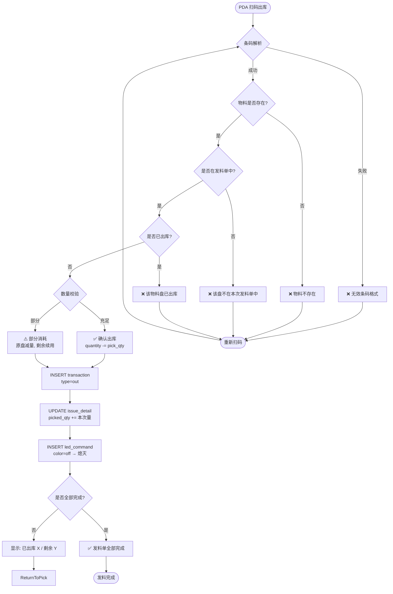
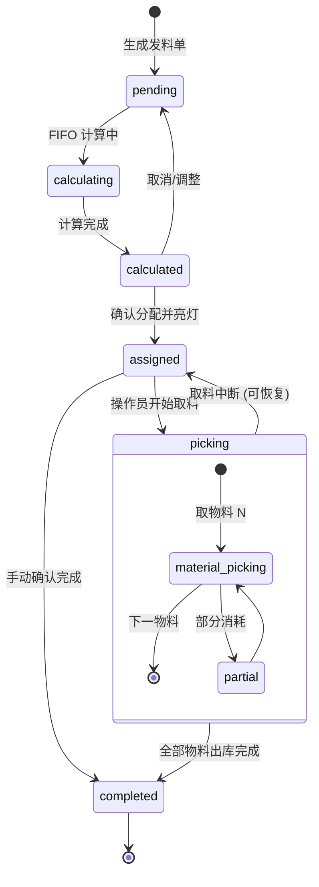

# 七鑫智能物料架系统 · 通信关系与流程图

> 基于《02.系统设计_Part1~Part7》整理
> 生成日期：2026-06-18
> 读者对象：Design / Dev / QA / PM

---

## 一、系统通信关系总览

### 1.1 通信拓扑

```
┌──────────────────────────────────────────────────────────────────┐
│                        工厂局域网 (WiFi/Ethernet)                  │
│                                                                  │
│  ┌──────────────┐          ┌──────────────────────┐              │
│  │  Android PDA  │          │     PC Web (管理端)   │              │
│  │  Kiosk App   │          │   React 18 + AntD 5  │              │
│  │  (操作员)     │          │   (仓库管理/配置)     │              │
│  └──────┬───────┘          └──────────┬───────────┘              │
│         │                             │                           │
│         │  HTTP/REST (HTTPS)          │  HTTP/REST (HTTPS)        │
│         │  Base: :8080/api/v1         │  Base: :8080/api/v1       │
│         ▼                             ▼                           │
│  ┌──────────────────────────────────────────────────┐             │
│  │           Backend API (FastAPI, Python 3.11)      │             │
│  │                                                   │             │
│  │  ┌─────────────┐  ┌──────────────┐  ┌────────┐  │             │
│  │  │ Auth Router  │  │ Business     │  │   DB   │  │             │
│  │  │ Material API │  │ Logic Layer  │  │SQLite/ │  │             │
│  │  │ Receipt API  │  │ FIFO Service │  │Postgres│  │             │
│  │  │ Issue/LED API│  │ LED Service  │  └────────┘  │             │
│  │  │ XR/API       │  │ Slot Reader  │              │             │
│  │  └─────────────┘  └──────┬───────┘               │             │
│  │                          │ HAL (硬件抽象层)        │             │
│  └──────────────────────────┼───────────────────────┘             │
│                              │ Modbus TCP (Port 502)              │
│                    ┌─────────▼─────────┐                          │
│                    │ AMKN8702G 主控板    │  站号: 200              │
│                    │ IP: DHCP/静态配置   │                          │
│                    │  继电器 K1-K6      │                          │
│                    │  COM1 → A面        │                          │
│                    │  COM2 → B面        │                          │
│                    └──────┬─────┬───────┘                          │
│                           │ RS485   │ RS485                       │
│                    ┌──────▼─────┐ ┌─┴─────────────────┐            │
│                    │ AMKN7141   │ │ AMKN7141 灯板 ×N    │            │
│                    │ 灯板 (A面) │ │ A面: 站号 1-N       │            │
│                    │ 20/10/6    │ │ B面: 站号 1-N       │            │
│                    │ 储位/板    │ │ LED: 三色 (G/R/B)   │            │
│                    └────────────┘ │ 38400bps            │            │
│                                    └───────────────────┘            │
└──────────────────────────────────────────────────────────────────┘

其他外围设备:
  XR 点料机 ──蓝牙/串口/WiFi──► Android PDA ──POST /api/xr/upload──► Backend
  ZPL 标签打印机 ──TCP:9100 (ZPL)──► Backend (打印标签)
  XR 点料机 ──蓝牙/串口/WiFi──► Android PDA ──POST /api/xr/upload──► Backend
```

### 1.2 前后端 ↔ 硬件通信矩阵

| 通信方向 | 协议 | 端口/总线 | 频率 | 用途 |
|----------|------|-----------|------|------|
| PDA → Backend | HTTP/REST (JSON) | TCP :8080 | 请求触发 | 扫码、操作确认、状态查询 |
| PC Web → Backend | HTTP/REST (JSON) | TCP :8080 | 请求触发 | BOM 上传、发料单管理、报表查询 |
| Backend → AMKN8702G | Modbus TCP | TCP :502 | 事件触发 + 定时轮询 | LED 控制、储位状态读取 |
| AMKN8702G ↔ AMKN7141 | RS485 | Serial 38400bps | 硬件层 | 主控板转发 Modbus RTU 到灯板 |
| Backend → ZPL 打印机 | TCP raw (ZPL) | TCP :9100 | 事件触发 | 入库标签打印 |
| PDA → XR 点料机 | 蓝牙/串口/WiFi | 协议私有 | 操作触发 | 点数数据采集 |
| PDA → Backend (XR) | HTTP/REST POST | TCP :8080 | 事件触发 | XR 数据上报 (`/api/xr/upload`) |

### 1.3 Modbus TCP 地址映射

| 功能 | 功能码 | 地址范围 | 方向 | 说明 |
|------|--------|----------|------|------|
| 储位状态读取 | FC2 读离散输入 | A面: 1000+, B面: 2000+ | 主控板→Backend | 1 位 = 1 储位 (占用/空) |
| LED 灯控制 | FC15 写多线圈 | 10000+ (协议2) | Backend→主控板 | 每 LED = 4 bit (G/R/B/控制位) |
| 继电器控制 | FC5 写单线圈 | 按需 | Backend→主控板 | K1-K6 继电器 |
| 灯板数量探测 | FC3 读保持寄存器 | 60107-60109 | 主控板→Backend | 自动发现 |
| 参数存储 | FC6/FC16 写寄存器 | 60121 | Backend→主控板 | 0x0001=存储, 0x0005=复位, 0x0004=校准 |

### 1.4 站号映射规则

| 物理位置 | Modbus TCP 站号 | COM 通道 | A 面灯板地址 | B 面灯板地址 |
|----------|----------------|----------|-------------|-------------|
| A面 灯板 1 | 1 | COM1 | LED 1-20 | — |
| A面 灯板 10 | 10 | COM1 | LED 181-200 | — |
| B面 灯板 1 | 64 | COM2 | — | LED 1-20 |
| B面 灯板 10 | 73 | COM2 | — | LED 181-200 |

---

## 二、上架流程 (料盘放入料架)

### 2.1 泳道图 — 感应自动上架（推荐方案）

```mermaid
flowchart TD
    Start([操作员开始上架]) --> Step1

    subgraph PDA[Android PDA — 操作员]
        Step1[扫描 Reel 标签条码] --> Step2{扫码结果}
        Step2 -->|成功| Step3[显示待上架界面<br/>物料/数量/状态]
        Step2 -->|失败| Step1
        Step3 --> Step4[将 Reel 放入任意空储位]
        Step4 --> Step5{检测上架结果}
        Step5 -->|成功| Success([✅ 上架完成])
        Step5 -->|超时未检测| ManualFallback[回退手动分配]
    end

    subgraph Backend[Backend API — FastAPI]
        ScanAPi[接收扫码请求<br/>POST /receipts/{id}/scan] --> Verify{物料验证}
        Verify -->|通过| CreateReel[创建库存盘<br/>inventory_pallets<br/>status=on_shelf]
        Verify -->|不通过| ErrorResp[返回错误]
        CreateReel --> AssignSlot{储位自动分配?}
        AssignSlot -->|有空位| AutoAssign[自动分配空储位<br/>shelf_slot_id]
        AssignSlot -->|无空位| ManualAssign[标记待手动分配]
        AutoAssign --> Confirm[返回确认响应<br/>含储位信息]
        ManualAssign --> Confirm
        Confirm --> PDAConfirm[PDA 显示确认信息]
        
        SensorCallback{传感器状态变化<br/>空 → 占用} --> DetectChange[检测 Slot N 变化]
        DetectChange --> AutoBind[自动绑定 Reel<br/>shelf_slot_id = Slot N.id]
        AutoBind --> UpdateStatus[更新 inventory_pallets<br/>shelf_slot_id = N]
        UpdateStatus --> NotifyPDA[推送上架成功通知<br/>料架/储位信息]
        NotifyPDA --> PDAConfirm2[PDA 显示上架成功]
    end

    subgraph HAL[硬件层 — AMKN8702G + AMKN7141]
        SlotReader[SlotReader 轮询器<br/>1s 间隔] --> PollSlots[批量读取储位状态<br/>FC2 读离散输入<br/>A面:1000+ B面:2000+]
        PollSlots --> DiffDetect{状态对比<br/>has_change?}
        DiffDetect -->|有变化| NotifyBackend[触发回调<br/>SlotChange event]
        DiffDetect -->|无变化| PollSlots
        NotifyBackend --> SensorCallback
    end

    Step1 --> ScanAPi
    PDAConfirm -.-> Start
    PDAConfirm2 -.-> Start
    ErrorResp --> Step1
    ManualFallback --> ManualStep
    ManualStep[手动选择储位] --> ManualAssign2[POST 分配储位]
    ManualAssign2 --> CreateReel
```

### 2.2 泳道图 — 手动分配储位（备选方案）

```mermaid
flowchart TD
    Start([操作员开始上架]) --> S1

    subgraph PDA[Android PDA — 操作员]
        S1[扫描 Reel 标签条码] --> S2{扫码结果}
        S2 -->|成功| S3[显示待上架 + 可用储位列表]
        S2 -->|失败| S1
        S3 --> S4[选择目标储位<br/>或扫码储位编号]
        S4 --> S5[确认分配]
        S5 --> S6[显示上架成功]
        S6 --> End([上架完成])
    end

    subgraph Backend[Backend API — FastAPI]
        ScanReq[接收扫码请求<br/>POST /receipts/{id}/scan] --> MVerify{物料验证}
        MVerify -->|通过| MCreate[创建库存盘<br/>inventory_pallets]
        MVerify -->|不通过| MError[返回错误]
        MCreate --> MSlot[接收储位分配请求<br/>PUT /receipts/{id}/assign-slot]
        MSlot --> MCheck{校验储位}
        MCheck -->|为空且容量够| MBind[绑定 Reel→储位<br/>update shelf_slot_id]
        MCheck -->|已占用/容量不足| MReject[拒绝: 提示原因]
        MBind --> MConfirm[返回分配成功]
        MReject --> MSlot
        MConfirm --> MNotify[PDA 显示成功]
    end

    S1 --> ScanReq
    MNotify --> S3
    MError --> S1
```

### 2.3 PC Web 端手动分配储位流程

```mermaid
flowchart LR
    subgraph PC[PC Web 管理端]
        PC1[入库收料 → 收料单详情] --> PC2[选择目标明细行]
        PC2 --> PC3[点击"分配储位"]
        PC3 --> PC4[选择料架 SH-A-01]
        PC4 --> PC5[选择面 A/B]
        PC5 --> PC6[选择储位号]
        PC6 --> PC7[确认分配]
    end

    subgraph Backend[Backend API]
        PC_API[POST /receipts/{id}/assign-slot] --> PC_DB[(更新 inventory_pallets<br/>shelf_slot_id)]
        PC_DB --> PC_OK[返回成功响应]
    end

    PC7 --> PC_API
    PC_API --> PC_DB
    PC_OK --> PC8[界面刷新显示储位]
```

---

## 三、下架流程 (料盘从料架取出 / 发料出库)

### 3.1 泳道图 — 完整发料出库流程

```mermaid
flowchart TD
    Start([发料出库流程启动]) --> BOMCheck{BOM 是否已上传?}
    BOMCheck -->|否| BOMUpload[PC Web: BOM 上传]
    BOMUpload --> BOMGen[生成发料单<br/>POST /bom/{id}/generate-issue]
    BOMCheck -->|是| BOMGen
    BOMGen --> Calc[执行 FIFO 计算<br/>POST /issues/{id}/calculate]
    Calc --> CheckSlot{库存是否充足?}
    CheckSlot -->|充足| AssignLED[下发亮灯指令<br/>POST /issues/{id}/assign]
    CheckSlot -->|短缺| ShortageOpt{操作员选择}
    ShortageOpt -->|仅出库可用量| AssignLED
    ShortageOpt -->|取消发料单| EndCancel([流程终止])

    subgraph LED[Backend → 硬件层 — LED 亮灯]
        AssignLED --> InsertLed[写入 led_commands 表<br/>status=queued]
        InsertLed --> Worker[Worker 每 2s 轮询<br/>消费 queued 指令]
        Worker --> Modbus[发送 Modbus TCP<br/>FC15 写多线圈<br/>地址 10000+]
        Modbus --> LEDOn[料架 LED 亮绿灯<br/>引导取料]
    end

    subgraph PDA[Android PDA — 操作员]
        LEDOn --> PickOp[操作员按亮灯指引取料]
        PickOp --> ScanPick[PDA 扫描 Reel 条码]
        ScanPick --> VerifyPick{出库校验}
        VerifyPick -->|通过| Decrement[减少库存数量<br/>记录 transaction]
        VerifyPick -->|不通过| PickError[提示错误<br/>返回重新扫描]
        Decrement --> ClearLED[清除储位 LED<br/>熄灭绿灯]
        ClearLED --> CheckDone{全部出库完成?}
        CheckDone -->|否| PickOp
        CheckDone -->|是| Complete[发料单 → completed]
    end

    subgraph Hardware[硬件层 — Modbus/LED]
        ClearLED --> LedOff[Modbus FC15<br/>写灭灯指令]
        LedOff --> LedClear[储位 LED 熄灭]
        LedClear --> SlotCheck{SlotReader 检测<br/>空位确认}
        SlotCheck -->[更新库存状态]
    end

    BOMGen --> Calc
    AssignLED --> LED
    PickOp -.-> LEDOn
    AssignLED -.-> LED
    PickError --> ScanPick
    Complete --> End([发料完成])
    EndCancel --> End2([流程结束])
```

### 3.2 出库扫码校验详图



### 3.3 发料单状态机



---

## 四、XR 退库流程 (料盘退回后重新上架)

```mermaid
flowchart TD
    subgraph PDA_Pick[Android PDA — 取料端]
        Pick[按 LED 指引取料] --> XrStart[开启 XR 点料机]
        XrStart --> XrScan[XR 扫描 Reel 条码]
        XrScan --> XrCount[XR 点数 (自动计数)]
        XrCount --> XrSubmit[提交点数到 PDA]
    end

    subgraph BackendXR[Backend API — XR 处理]
        XrSubmit --> XrPost[POST /api/xr/upload<br/>reel_id + qty]
        XrPost --> XrFind{查找 tracking 库存盘}
        XrFind -->|未找到| XrFail[标记配对失败<br/>需人工处理]
        XrFind -->|找到| TimeCheck{±5s 窗口内?}
        TimeCheck -->|是| XrMatch[配对成功<br/>status=ready_restock]
        TimeCheck -->|否| XrFail
        XrMatch --> ZplPrint[TCP:9100 打印 ZPL 标签]
        ZplPrint --> XrNotify[通知 PDA 配对成功]
    end

    subgraph PDA_Restock[Android PDA — 退库确认]
        XrNotify --> RestockConfirm[PDA 显示退库成功<br/>提示确认上架]
        RestockConfirm --> RestockAction[确认退库 + 选择新储位]
        RestockAction --> RestockAPI[POST /xr/{id}/confirm-restock<br/>shelf_slot_id]
        RestockAPI --> RestockUpdate[更新 inventory_pallets<br/>last_in_time, shelf_slot_id]
        RestockUpdate --> RestockDone([退库上架完成])
    end

    XrFail --> ManualReview[人工手动配对<br/>POST /xr/{id}/match]
    ManualReview --> RestockAPI
```

---

## 五、数据流汇总

### 5.1 上架数据流

```
扫码条码 → Backend (创建 inventory_pallet) → 自动/手动分配 shelf_slot_id
    → 写入 shelf_slot_events (事件记录)
    → 感应上架: SlotReader 检测 → 自动绑定 → 推送 PDA 确认
    → 手动上架: PUT /assign-slot → 校验储位 → 绑定确认
```

### 5.2 下架数据流

```
BOM 上传 → 生成发料单 → FIFO 计算 → LED 指令写入 led_commands 表
    → Worker 轮询 → Modbus TCP FC15 → LED 亮绿灯 → PDA 等待
    → 扫码出库 → 校验 (防呆) → 更新 quantity / transaction
    → 清除 LED → 更新发料单状态 → 完成
```

### 5.3 涉及的数据库表汇总

| 流程 | 读表 | 写/更新表 |
|------|------|----------|
| **上架 (扫码)** | `material_master`, `shelf_slots` (空闲查询) | `inventory_pallets` (shelf_slot_id), `shelf_slot_events` |
| **上架 (感应)** | `shelf_slots` (状态) | `inventory_pallets` (shelf_slot_id), `shelf_slot_events` |
| **上架 (手动)** | `shelf_slots` (校验) | `inventory_pallets` (shelf_slot_id) |
| **下架 (发料)** | `inventory_pallets` (FIFO), `bom_details`, `issue_detail` | `issue_order` (状态), `issue_detail` (picked_qty), `led_commands` |
| **下架 (出库)** | `inventory_pallets`, `issue_detail`, `led_commands` | `inventory_pallets` (quantity), `transactions` (out), `led_commands` (cleared) |
| **退库 (XR)** | `inventory_pallets` (tracking), `transactions` | `inventory_pallets` (status, last_in_time), `xr_batches` |
| **报表** | `transactions`, `inventory_pallets` | 只读 (报表查询) |

---

## 六、关键通信时序要点

1. **PDA 扫码 → 后端响应**: 典型延迟 < 200ms (局域网 REST)
2. **后端 → LED 亮灯**: 典型延迟 < 1s (Modbus TCP FC15 批量写)
3. **SlotReader 轮询**: 1s 间隔，状态变化通过回调即时通知业务层
4. **XR 配对窗口**: ±5s (可配置)，基于 `last_out_time` 时间戳匹配
5. **LED 常亮策略**: 默认常亮直到扫码出库自动熄灭 (配置 `led_clear_auto`)
6. **重连机制**: ModbusTCPClient 指数退避重连，最大间隔 300s
7. **离线模式**: PDA 本地 SQLite 缓存，网络恢复后自动同步
