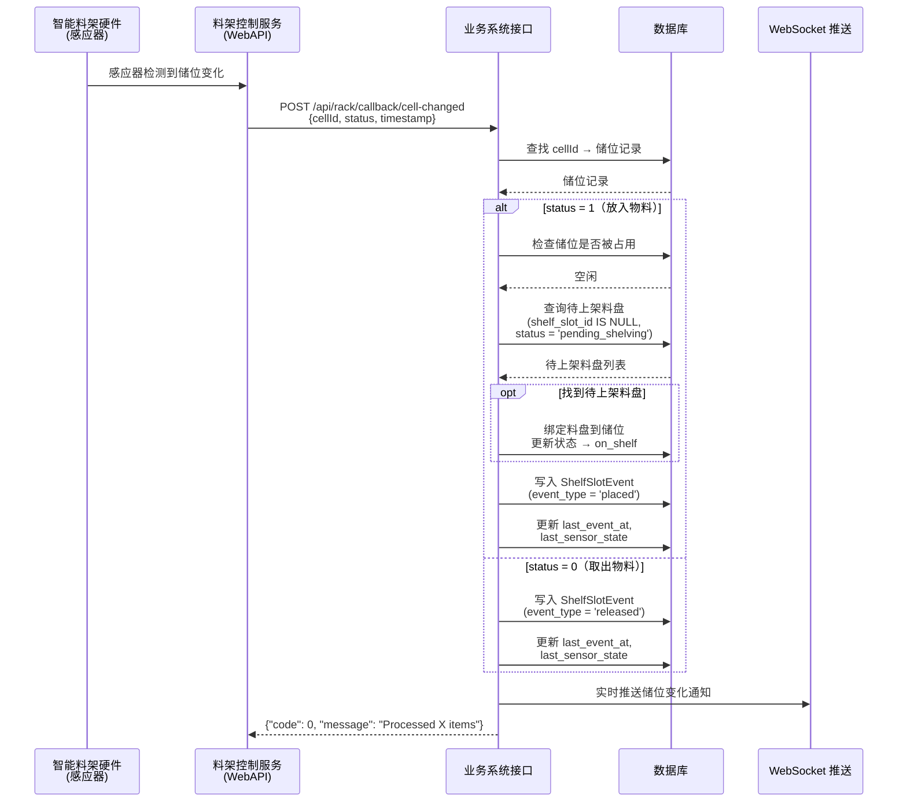

# 储位变化回调接口规范

> **文档用途**: 供应商传阅 — 料架控制服务 → 业务系统  
> **版本**: V1.0  
> **日期**: 2026-06-26  
> **协议**: HTTP POST + JSON (UTF-8)

---

## 目录

1. [概述](#1-概述)
2. [接口定义](#2-接口定义)
3. [请求格式](#3-请求格式)
4. [响应格式](#4-响应格式)
5. [业务处理逻辑](#5-业务处理逻辑)
6. [完整示例](#6-完整示例)
7. [异常处理](#7-异常处理)
8. [常见问题](#8-常见问题)

---

## 1. 概述

### 1.1 作用

当智能料架的感应器检测到储位状态发生变化（放入物料 / 取出物料）时，**料架控制服务**通过 HTTP POST 回调此接口，通知业务系统进行后续处理。

### 1.2 术语

| 术语 | 说明 |
|------|------|
| **料架控制服务** | 智能料架配套的上位机服务，负责与硬件通信，提供 HTTP API |
| **业务系统** | 七鑫智能物料管理系统（ComsumableManager），接收回调并处理业务逻辑 |
| **储位号 (cellId)** | 唯一标识一个储位的字符串，格式见第 3 节 |
| **回调** | 料架控制服务主动发起 HTTP 请求到业务系统指定的接口 |

### 1.3 调用时序



---

## 2. 接口定义

| 项目 | 值 |
|------|-----|
| **接口路径** | `POST /api/rack/callback/cell-changed` |
| **Method** | `POST` |
| **Content-Type** | `application/json;charset=utf-8` |
| **调用方** | 料架控制服务（智能料架的上位机软件） |
| **提供方** | 七鑫智能物料管理系统（ComsumableManager） |
| **调用时机** | 感应器检测到储位由空变满或由满变空时 |

---

## 3. 请求格式

### 3.1 请求头

| Header | 值 | 必须 |
|--------|-----|------|
| `Content-Type` | `application/json;charset=utf-8` | 是 |

### 3.2 请求体结构

```json
{
  "data": [
    {
      "cellId": "A0010001",
      "status": 1,
      "timestamp": "2026-06-26T10:00:00"
    }
  ],
  "code": 0,
  "message": "OK",
  "sessionId": "c7021573-8c40-4c38-a44e-6d8a43935d77"
}
```

### 3.3 字段说明

#### 顶层字段

| 字段 | 类型 | 必须 | 说明 |
|------|------|------|------|
| `data` | array | 是 | 储位变化列表，支持一次回调多个储位 |
| `code` | integer | 是 | 固定传 `0`（料架侧状态码） |
| `message` | string | 否 | 状态描述，如 `"OK"` |
| `sessionId` | string | 否 | 会话追踪 ID，建议使用 UUID |

#### data[]. 储位变化项

| 字段 | 类型 | 必须 | 说明 |
|------|------|------|------|
| `cellId` | string | 是 | **储位号**，全局唯一标识一个储位。格式：`料架号(可变长) + 储位序号(4位)`，如 `A0010001` = 料架 A001 第 0001 号储位 |
| `status` | integer | 是 | **变化类型**：`1` = 放入（传感器由空变满），`0` = 取出（传感器由满变空） |
| `timestamp` | string | 是 | **事件发生时间**，ISO 8601 格式，如 `"2026-06-26T10:00:00"` |

### 3.4 请求示例

**单个储位放入物料：**

```json
{
  "data": [
    {
      "cellId": "A0010001",
      "status": 1,
      "timestamp": "2026-06-26T10:00:00"
    }
  ],
  "code": 0,
  "message": "OK",
  "sessionId": "c7021573-8c40-4c38-a44e-6d8a43935d77"
}
```

**多个储位同时变化：**

```json
{
  "data": [
    {
      "cellId": "A0010001",
      "status": 1,
      "timestamp": "2026-06-26T10:00:00"
    },
    {
      "cellId": "A0010002",
      "status": 0,
      "timestamp": "2026-06-26T10:00:01"
    },
    {
      "cellId": "A0020005",
      "status": 1,
      "timestamp": "2026-06-26T10:00:02"
    }
  ],
  "code": 0,
  "message": "OK",
  "sessionId": "a1b2c3d4-e5f6-7890-abcd-ef1234567890"
}
```

---

## 4. 响应格式

### 4.1 响应体结构

```json
{
  "code": 0,
  "message": "Processed 1 items",
  "sessionId": "c7021573-8c40-4c38-a44e-6d8a43935d77"
}
```

### 4.2 字段说明

| 字段 | 类型 | 说明 |
|------|------|------|
| `code` | integer | 处理结果：`0` = 成功接收并处理；非 `0` = 处理异常 |
| `message` | string | 结果描述，如 `"Processed 2 items"` 或错误描述 |
| `sessionId` | string | 原请求的 `sessionId`，用于调用方追踪 |

### 4.3 HTTP 状态码

| 状态码 | 说明 |
|--------|------|
| `200` | 请求已接收并处理完成（无论处理成功还是部分失败） |
| `500` | 服务器内部错误（极少发生，料架侧应重试） |

> **注意**: 即使部分 cellId 处理失败（如未知储位号），也返回 HTTP 200。  
> 料架侧应通过 `message` 中的 `"Processed X/Y items"` 判断是否全部处理成功。

---

## 5. 业务处理逻辑

业务系统收到回调后，按以下流程处理每个储位变化项：

### 5.1 status = 1（放入物料）

```
收到 "放入" 回调
    │
    ├── 1. 根据 cellId 查找对应的储位记录
    │      ├─ 找到   → 继续
    │      └─ 未找到 → 跳过（记录警告日志）
    │
    ├── 2. 检查该储位是否已被占用
    │      ├─ 已占用 → 跳过（防止重复绑定）
    │      └─ 空闲   → 继续
    │
    ├── 3. 查找待上架的料盘
    │      ├─ 条件: shelf_slot_id IS NULL, status = 'pending_shelving'
    │      ├─ 排序: 按创建时间升序（先进先上架）
    │      ├─ 找到   → 将料盘绑定到该储位，状态置为 on_shelf
    │      └─ 未找到 → 仅记录事件，等待后续手动绑定
    │
    ├── 4. 记录储位变化事件到 shelf_slot_events 表
    │
    ├── 5. 更新储位的 last_event_at 和 last_sensor_state
    │
    └── 6. 通过 WebSocket 推送实时通知
```

### 5.2 status = 0（取出物料）

```
收到 "取出" 回调
    │
    ├── 1. 根据 cellId 查找对应的储位记录
    │      ├─ 找到   → 继续
    │      └─ 未找到 → 跳过（记录警告日志）
    │
    ├── 2. 记录储位变化事件（event_type = 'released'）
    │
    ├── 3. 更新储位的 last_event_at 和 last_sensor_state
    │
    └── 4. 通过 WebSocket 推送实时通知
```

> **说明**: 取出事件不自动解绑料盘，料盘状态由出库流程（扫码确认）管理。

---

## 6. 完整示例

### 6.1 放入物料 — 自动绑定成功

**回调请求：**
```json
{
  "data": [
    {
      "cellId": "A0010001",
      "status": 1,
      "timestamp": "2026-06-26T10:00:00"
    }
  ],
  "code": 0,
  "message": "OK",
  "sessionId": "c7021573-8c40-4c38-a44e-6d8a43935d77"
}
```

**响应：**
```json
{
  "code": 0,
  "message": "Processed 1 items",
  "sessionId": "c7021573-8c40-4c38-a44e-6d8a43935d77"
}
```

**业务效果：**
- 系统找到一个待上架的料盘（ID=1024）
- 自动绑定：`inventory_reels.shelf_slot_id → shelf_slots.id`
- 料盘状态从 `pending_shelving` 更新为 `on_shelf`
- 储位抽屉页面立即显示该储位已被占用

### 6.2 放入物料 — 无待上架料盘

**回调请求：**
```json
{
  "data": [
    {
      "cellId": "A0010002",
      "status": 1,
      "timestamp": "2026-06-26T10:05:00"
    }
  ],
  "code": 0,
  "message": "OK",
  "sessionId": "d8b5f6a1-1234-5678-90ab-cdef12345678"
}
```

**响应：**
```json
{
  "code": 0,
  "message": "Processed 1 items",
  "sessionId": "d8b5f6a1-1234-5678-90ab-cdef12345678"
}
```

**业务效果：**
- 系统查到储位 A0010002 的 DB 记录
- 但无 pending_shelving 状态的待上架料盘
- 仅记录 `ShelfSlotEvent` 事件，不绑定
- PDA 或管理页面后续可通过手动分配来绑定

### 6.3 未知储位号

**回调请求：**
```json
{
  "data": [
    {
      "cellId": "UNKNOWN9999",
      "status": 1,
      "timestamp": "2026-06-26T10:10:00"
    }
  ],
  "code": 0,
  "message": "OK",
  "sessionId": "e9f8a7b6-5432-10fe-dcba-0987654321fe"
}
```

**响应：**
```json
{
  "code": 0,
  "message": "Processed 0 items",
  "sessionId": "e9f8a7b6-5432-10fe-dcba-0987654321fe"
}
```

**业务效果：**
- 系统日志记录 `WARNING: Callback unknown cell_id: UNKNOWN9999`
- 跳过处理，不影响其他储位
- 料架侧应检查 cellId 是否与业务系统配置一致

### 6.4 取出物料

**回调请求：**
```json
{
  "data": [
    {
      "cellId": "A0010001",
      "status": 0,
      "timestamp": "2026-06-26T11:00:00"
    }
  ],
  "code": 0,
  "message": "OK",
  "sessionId": "f1e2d3c4-b5a6-7890-1234-567890abcdef"
}
```

**响应：**
```json
{
  "code": 0,
  "message": "Processed 1 items",
  "sessionId": "f1e2d3c4-b5a6-7890-1234-567890abcdef"
}
```

**业务效果：**
- 记录 `ShelfSlotEvent`（event_type = "released"）
- 更新储位的 `last_sensor_state = 0`
- WebSocket 推送通知
- 料盘绑定关系不变（通过出库扫码正式解绑）

---

## 7. 异常处理

### 7.1 料架侧重试策略

| 场景 | 建议行为 |
|------|---------|
| HTTP 超时（> 5s 无响应） | 间隔 1s, 2s, 4s 指数退避重试，最多 3 次 |
| HTTP 429（Too Many Requests） | 间隔 5s 后重试 |
| HTTP 500/502/503 | 间隔 3s 后重试，最多 3 次 |
| 网络不可达 | 记录错误日志，缓存事件，网络恢复后补发 |

### 7.2 业务系统幂等性

回调接口天然具备**幂等性**：

- 同一条 `cellId + status + timestamp` 重复回调，会产生多条 `ShelfSlotEvent` 记录（审计用途）
- 自动绑定仅在储位空闲且有待上架料盘时执行一次，重复回调不会重复绑定
- 未知 `cellId` 的重复回调仅记录警告，不影响系统状态

### 7.3 数据兜底

除了回调实时更新外，业务系统每 10 秒通过 `GetCellList` API 全量轮询所有储位状态，确保回调丢失时数据仍能最终一致。此机制对料架侧透明，无需料架侧额外处理。

---

## 8. 常见问题

### Q1: cellId 的格式是什么？

**A:** `料架号(可变长) + 储位序号(4位)`。料架号由业务系统定义，储位序号从 `0001` 开始递增。  
示例：料架 `A001` 的第 1 号储位 → `A0010001`，料架 `SH-A-01` 的第 5 号储位 → `SHA010005`。

> 具体料架号和储位范围请在部署时与业务系统确认。

### Q2: 一次回调可以带多少个储位变化？

**A:** 建议不超过 100 个。如果短时间内多个储位同时变化，请合并到一次回调中发送。

### Q3: 业务系统多久返回响应？

**A:** 通常在 100ms 以内。每个储位变化项涉及 2~3 次数据库查询 + 一次 WebSocket 推送。如超过 5 秒未收到响应，料架侧应重试。

### Q4: 回调失败会影响业务吗？

**A:** 不会。业务系统有独立的 10 秒轮询兜底机制，即使回调全部丢失，最迟 10 秒后储位状态会自动同步。但自动上架绑定功能依赖回调，回调丢失时需人工通过管理页面手动绑定。

### Q5: 需要鉴权吗？

**A:** 当前接口不强制鉴权（料架控制服务和业务系统部署在同一内网）。如需安全加固，料架侧可通过 IP 白名单或预共享 Token（置于请求头 `Authorization: Bearer <token>`）接入。

### Q6: 部署后如何验证？

**A:** 使用 curl 命令模拟回调：
```bash
curl -X POST http://<业务系统IP>:8000/api/rack/callback/cell-changed \
  -H "Content-Type: application/json" \
  -d '{
    "data": [
      {"cellId": "A0010001", "status": 1, "timestamp": "2026-06-26T10:00:00"}
    ],
    "code": 0,
    "message": "OK",
    "sessionId": "test-curl-001"
  }'
```
预期返回 `{"code": 0, "message": "Processed 1 items", "sessionId": "test-curl-001"}`。

---

## 附录 A：变更记录

| 版本 | 日期 | 变更内容 | 作者 |
|------|------|---------|------|
| V1.0 | 2026-06-26 | 初始版本，基于实际代码库实现整理 | 华澄科技 |
